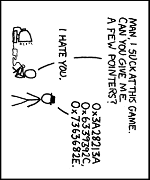

# Hack 7.0 - Arrays
**[School of Computing](https://computing.unl.edu/)**  
**[College of Engineering](https://engineering.unl.edu/)**  
**[University of Nebraska-Lincoln](https://unl.edu)**  
**[University of Nebraska-Omaha](https://http://unomaha.edu/)**  

# Introduction

Hack session activities are small weekly programming assignments
intended to get you started on full programming assignments. You may
complete the hack on your own, but you are *highly encouraged* to work
with another student and form a hack pair. Groups larger than 2 are not
allowed. However, you may discuss the problems *at a high level* with
other students or groups. You may not share code directly outside your
pair.

If you choose to form a Hack Pair, you *must*:

1.  Both join a hack pair on Canvas (go to People then Groups)

2.  You must both work on the hack equally; it must be an equal effort
    by both partners. Do not undermine your partner's learning
    opportunity and do not undermine your own by allowing one parter to
    do all the work.

3.  Both of you should hand in a copy of your code, but we'll grade the
    code under the individual whose last name comes first alphabetically.

## Rubric

You are graded based on style, documentation, design and correctness.
For detail, see the general course rubric.

| Category      | Points |
|---------------|--------|
| Style         | 2      |
| Documentation | 2      |
| Design        | 5      |
| Correctness   | 16     |
| Total         | 25     |

Correctness:

-   8 points on the array part, 2 for the first test suite, 6 for the
    second

-   8 points for the image part, 2 points for each test suite all
    proportional

# Exercises

To get more practice working with arrays, you will write several
functions that involve operations on arrays. In particular, implement
the following functions.

1.  Write a function that, given an integer array and an integer $x$
    determines if the array contains $x$ anywhere within the array. It
    should return true if it does, false otherwise.

    `int contains(const int *arr, int size, int x);`

2.  Write a function that, given an integer array and an integer $x$,
    determines if the array contains $x$ within the range of the two
    provided indices $i\;and\; j$ (including both indices). It should
    return true if it does, false otherwise.

    `int containsWithin(const int *arr, int size, int x, int i, int j);`

3.  Write a function that, given an array of integers, its size and a
    "new size" creates a new deep copy of the array. However, instead of
    its original size, the new array should be of the new size. If the
    new size is less than the old size, only the first `newSize`
    elements should be copied over. If the new size is greater than the
    original size, then the new array should be padded out with zeros.

    `int * paddedCopy(const int *arr, int oldSize, int newSize);`

4.  Write a function that, given an array of integers and its size,
    reverses the elements in the array. For example, if the original
    array was `[10, 15, 5, 25, 0]` the new array should be
    `[0, 25, 5, 15, 10]`.

    `void reverse(int *arr, int size);`

5.  Write a similar function that creates and returns a new copy of the
    given array but with its elements in reverse order.

    `int * reverseCopy(const int *arr, int size);`

## Image Manipulation

You'll get more practice with 2-dimensional arrays by writing several
functions to manipulate images. We've adapted a C image library, the
"stb" library, and written several *wrapper functions* to load and save
images. Wrapper functions are functions that call other functions but
may have some "glue code" to make the control flow or data compatible.
In this case, our wrapper functions convert/translate the stb library's
image representation into an RGB pixel representation. We've defined a
`Pixel` structure that holds 3 integer values one for each of the
red, green, and blue color values. We'll cover structures in detail
later on, but it won't prevent you from working with them.

You can declare and use a `Pixel` type like you would an `int`
or `double`:

``` c
//a single pixel:
Pixel p;
//an array of n pixels:
Pixel *p = (Pixel *) malloc(sizeof(Pixel) * n);

//swap two pixels:
Pixel a, b;
...
Pixel temp = a;
a = b;
b = temp;
```

An $h \times w$ (height by width) image can be represented as a two
dimensional array of `Pixel` types; in particular:
`Pixel **image`. Everything we've covered using two dimensional
arrays of `int` types applies to `Pixel` types.

We've provided a library of functions to load and save a file (you'll
need to RTM) and specified several function signatures for functions you
need to implement.  For each function, we've provided examples of what
the resulting image should look like.  The original image is:


-   `copyImage()` should produce a deep copy of the given image.

-   `flipHorizontal()` should flip the image horizontally:


-   `flipVertical()` should flip the image vertically:


-   `rotateClockwise()` should produce a new image that is rotated
    90 degrees clockwise. This function must produce a new image because
    an $h \times w$ sized image that has been rotated will be a
    $w \times h$ image:



# Instructions

-   We have provided some starter code in the following project that you
    can clone:

    <https://github.com/cbourke/CSCE155-Hack7.0>

-   For the warm-up, place all your function prototypes into a file
    named `array_utils.h` and and their definitions in a file
    named `array_utils.c`. You will need to turn these in via
    webhandin.

-   You'll want to rigorously test your functions to verify they are
    correct. We've provided a starter test file,
    `arrayUtilsTester.c` that you can use. You do not need to
    hand in this file.

-   All functions should perform reasonable error checks and handling
    even though they are not returning error codes. Ex: an invalid or
    empty array cannot possibly hold an element $x$; functions that return a pointer
    can only return `NULL` for an error.

-   You should test all your functions with an image using the image
    driver program we've provided.

-   You should write/add documentation to all your functions *first*.
    Use this as an opportunity to think/discuss how the functions should
    work and to *whiteboard* your designs and solutions with other
    students.

-   You may (in fact are encouraged) to define any additional "helper"
    functions that may help you.

-   Turn in the following files to the webhandin, making sure that it
    runs and executes correctly in the grader.

    -   `array_utils.h`

    -   `array_utils.c`

    -   `imageUtils.h`

    -   `imageUtils.c`
