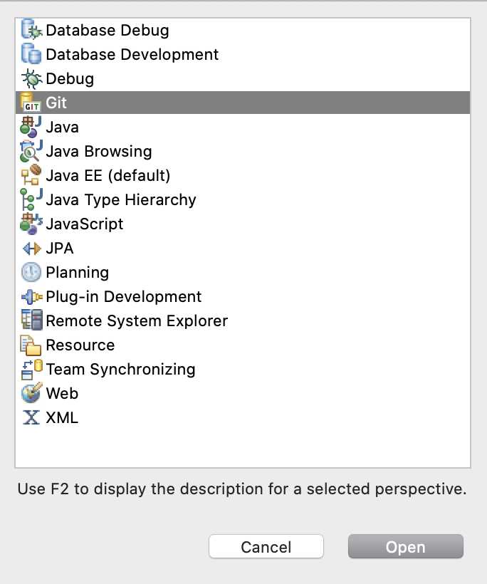
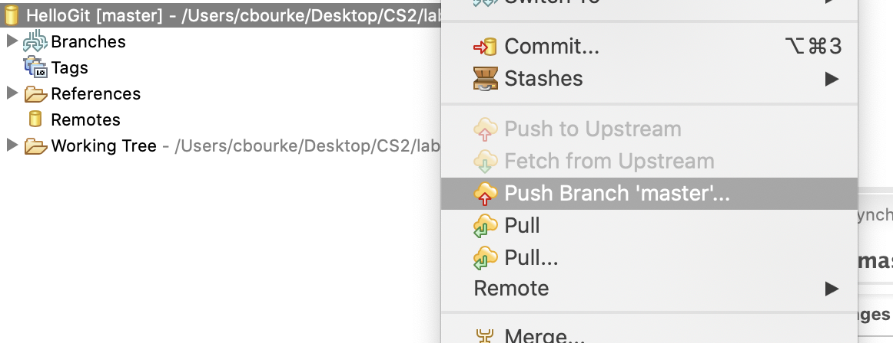
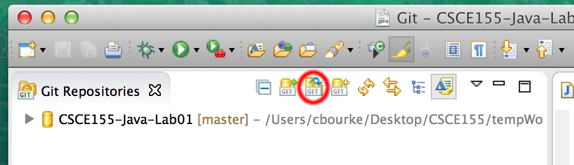
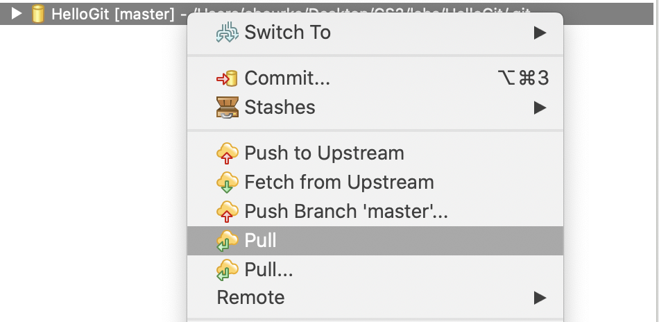
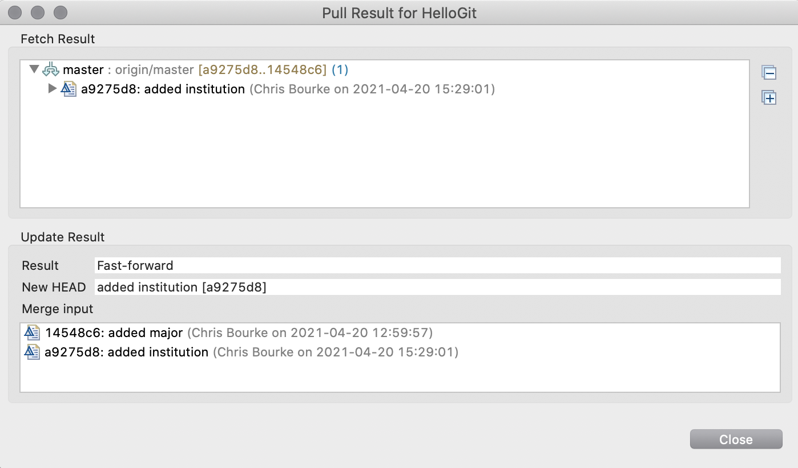

# Hack 1.0 - Getting Started With Git
## Java Edition
**[School of Computing](https://computing.unl.edu/)**  
**[College of Engineering](https://engineering.unl.edu/)**  
**[University of Nebraska-Lincoln](https://unl.edu)**  
**[University of Nebraska-Omaha](https://http://unomaha.edu/)**  

# Introduction

Hack session activities are small weekly programming assignments
intended to get you started on full programming assignments. You may
complete the hack on your own, but you are *highly encouraged* to work
with another student and form a hack pair. Groups larger than 2 are not
allowed. However, you may discuss the problems *at a high level* with
other students or groups. You may not share code directly.

If you choose to form a Hack Pair, you *must*:

1.  Both join a hack pair on Canvas (go to People then Groups)

2.  You must both work on the hack equally; it must be an equal effort
    by both partners. Do not undermine your partner's learning
    opportunity and do not undermine your own by allowing one parter to
    do all the work.

3.  Turn in only one copy of the code under the individual whose last
    name comes first (with respect to Canvas).

## Rubric

You are graded based on style, documentation, design and correctness.
For detail, see the general course rubric.

| Category      | Points |
|---------------|--------|
| Style         | 2      |
| Documentation | 2      |
| Design        | 5      |
| Correctness   | 16     |
| Total         | 25     |

For correctness:

-   Code itself needs to be correct: 4 pts

-   There should be more than one commit: 4 pts

-   All commits should have a descriptive comment: 3 pts

-   There must be at least 2 contributors: 5 pts

# Problem Statement

An essential tool when developing software is a *version control system*
(VCS). As you develop software you will make changes, add features, fix
bugs, etc. and it is necessary to keep track of your changes and to
ensure that your code and other artifacts are backed up and protected by
being stored on a reliable server (or multiple servers) instead of just
one machine.

A *version control system* allows you to "check-in" or *commit* changes
to a code project. It keeps track of all changes and allows you to
"branch" a code base into a separate copy so that you can develop
features or enhancements in isolation of the main code base (often
called the "trunk" in keeping with the tree metaphor). Once a branch is
completed (and well-tested and reviewed), it can then be *merged* back
into the main trunk and it becomes part of the project.

These systems are not only used for organizational and backup purposes,
but are absolutely essential when developing software as part of a team.
Each team member can have their own working copy of the project code
without interfering with other developer's copies or the main trunk.
Only when separate branches have to be merged into the trunk do
conflicting changes have to be addressed. Such a system allows multiple
developers to work on a very large and complex project in an organized
manner.


There are several widely used revision control systems including CVS
(Concurrent Versions System), SVN (Apache Subversion), and Git. SVN is a
*centralized* system: there is a single server that acts as the main
code repository. Individual developers can check out copies and branch
copies (which are also stored in the main repository).

Git is a *distributed* VCS meaning that multiple servers/computers act
as full repositories. Each copy on each developer's machine *also*
contains a complete revision history. This makes git a decentralized
system. Code commits are committed to a local repository. Merging a
branch into another requires a push/pull request. Decentralizing the
system means that anyone's machine can act as a code repository and can
lead to wider collaboration and independence since different parties are
no longer dependent on one master repository.

Git has become the de facto VCS system in software development. We have
provided several external resources below, but this Hack will walk you
through the basics of getting started. You will setup a project with git
using GitHub (<https://github.com>) as your remote server. You will then
collaborate with someone else to commit changes.

# Installation

Support for Git comes standard with Eclipse. Instead of using a command
line interface, however, you use Eclipse's graphical user interface to
perform the standard git operations.

# Setting Up a Repository

To focus on the git process, you will create and work with a simple
"Hello World"-style program but instead of printing "Hello World", it
will print your name.

1.  Create a new Java project (call it `HelloGit`) in Eclipse.
    Add a `Hello.java` source file with code in it that prints
    your name.

2.  First we need a Git *perspective* (a context in the Eclipse User
    Interface that will allow us to work with Git). To open the Git
    perspective, click on the "Open Perspective" tab in the upper right:

    

3.  Select "Git" from the menu and click OK

    

4.  Click the "Create a new repository and add it to this view" icon:

    

5.  Select the project folder for the Eclipse project you want to add as
    a git repo

    

## Git Ignore

Before we make our first commit, let's setup a `.gitignore` file.
Often times there will be files or *artifacts* that you want to create,
save and work with in your project *but* you don't want them committed
to the repository. For example, when you compile your programs you don't
want the compiled `.class` files committed to the repository. The
binary files are not part of your source code, but an *artifact* of your
code. In general, we want git to *ignore* these artifacts.

Eclipse creates a default `.gitignore` file when you create a new
repository. Unfortunately it is not very complete (usually it only
ignores the `bin` or "binary" directory). The following URL has a
more comprehensive standard `.gitignore` file for Java Eclipse
projects:

<https://github.com/github/gitignore/blob/master/Global/Eclipse.gitignore>

Open the `.gitignore` file in the "Git Staging" tab (item marked A.)
and in the left-hand editor copy-paste the contents of
the `.gitignore` file and save.


## Staging & Committing

Let's continue and make our first commit to our new repository.

1.  First, we need to "stage" files for our commit. In the Git Staging
    tab (see above, label 1.), select the file(s) you wish
    to commit and press the plus icon (see label 2.) *or* click the
    double plus to automatically stage all files at once.

    Note: in general, commits should be as small as possible. If you
    make a series of unrelated changes you should make separate commits
    instead of staging and committing all changes at once.

2.  Write a commit message (see label 3.) describing the changes. For
    this first commit, a commit message of `Initial Commit` is
    good enough. Make future commit message descriptive and thoroughly
    document the changes that have been made.

3.  Commit the changes by clicking "Commit" (see label 4.)

Just prior to committing, your Git Staging tab might look something
like:


## Pushing Changes

Though we have committed changes to our repository, those changes are
only to your *local* repository on your own computer. The changes still
need to be *pushed* to GitHub.

### Create a Repository on Github

1.  Go to your GitHub page (<https://github.com/login> where
    `login` is replaced with your GitHub login) and in the upper
    right, select `New repository`.

    

2.  Name your repo `HelloGit`

    

### Push to Github

1.  In Eclipse, go back to your git perspective

2.  Right-click your Git Repository and select "Push Branch master\..."

    

3.  In the dialog, fill out the URI of the repository that you created
    on Github and your *GitHub* user name and password.

    **Update**: as of August 2021, GitHub has changed its security
    requirements. Instead of providing a password, it now requires you
    to generate a personal access token. Instructions for how to do this
    are available here. Be sure to follow these instructions carefully,
    you need to click "repo" (Full control of private repositories).

    <https://docs.github.com/en/github/authenticating-to-github/keeping-your-account-and-data-secure/creating-a-personal-access-token>

    

4.  Click preview until you can click "Push" to finish.

### Making Changes

1.  In Eclipse, return to your Java perspective and add a line to your
    code to print your major.

2.  Go back to your git perspective and you'll see that the change is
    reflected in your Git Staging tab.

3.  Repeat the Commit-Push process to push this change to your Github
    repo.

    **NOTE**: you can view the differences in a file before committing
    them by double-clicking on the file!

# Collaborating With a Team

In this exercise, you'll need to team up with at least one other person.
You'll make them a collaborator on your project so they can make changes
and commit/push them to *your* repository on GitHub. Alternatively you
can have them make a *pull request*, but these instructions do not cover
that; refer to one of the resources in the [Additional
Resources](#section:additionalResources) section for how how to make
push/pull requests.

1.  On the GitHub webpage, click `Settings` in your project.

2.  In the left menu, click `Manage access`

3.  Click `Invite a collaborator` and type in your partner's
    GitHub user name and click `Add`

## What your collaborator needs to do

Together with your partner, walk through the following steps. These
steps should be done on *their* computer.

1.  Once you've sent an invite to collaborate, they need to accept it.

2.  Your partner will *clone* your repository in Eclipse

3.  Click the "Clone a Git repository" in the Git Repositories
    navigation menu:

    

4.  Copy/paste or type into the URI field, the URL of the project that
    you want to clone, then click "Next"

    

5.  Once Eclipse has cloned the project, the "master" branch should be
    selected (checkbox); click "Next" again.

    

6.  Select the directory where you want your project to be saved.
    Caution: the default option may not correspond to your default
    workspace. You will want to change it to your workspace. Also mark
    the "Import all existing projects after clone finishes" checkbox
    option or you will need to manually import the cloned project into
    Eclipse.

    

7.  Switch back to your Java perspective and you can see your cloned
    project.

8.  Your partner should add 2 lines of code to print their name and
    their major.

9.  Your partner should follow the same procedure to commit and push
    their changes to *your remote* repository using the same procedure
    as they did with theirs.

10. Verify their changes by refreshing your repository on GitHub. If you
    did everything correctly you should be able to see the changes in
    the file as well as multiple commits by multiple individuals. If you
    click on `History` you can see the changes for each commit.

## Pull Changes

Now, go back to *your* Eclipse. Remember, your partner's changes were
*pushed* to your *remote* repository hosted on GitHub. If you look at
the code on your own computer you won't see their changes because this
is your *local* repository.

In order to get your partner's changes you'll need to *pull* their
changes from your remote repository to your local repository. To do
this:

1.  Change to your git perspective

2.  Right click your repository and select "Pull"

    

3.  If successful a dialog will popup that looks something like this.

    

4.  Change back to your Java perspective and you can observe the
    changes.

## Finishing Up

1.  Put the URL for *your* GitHub repository into a plain text file
    named `readme.md`. Turn this file in using the handin.  If you paired
    up with a partner (in Canvas), be sure *both* your GitHub URLs are in the
    `readme.md` file.  The contents of your file should look
    *something* like this:

    ``` text
       https://github.com/cbourke/hello
    ```

    or

    ``` text
       https://github.com/cbourke/hello
       https://github.com/mypartner/hello
    ```

2.  **Be sure your repo is public**

# Additional Resources

-   My video tutorial for using Eclipse/git (from CS2):
    <https://www.youtube.com/watch?v=8bjtf6TZZGA&list=PL4IH6CVPpTZXOMCZRaFy_WRc-GvANOZfk&index=2>

-   Interactive git tutorial:
    <https://try.github.io/levels/1/challenges/1>

-   Pro Git, free online book: <https://git-scm.com/book/en/v2>
