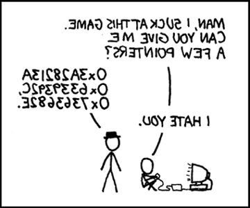

# Hack 7.0 - Arrays
## Java Edition
**[School of Computing](https://computing.unl.edu/)**  
**[College of Engineering](https://engineering.unl.edu/)**  
**[University of Nebraska-Lincoln](https://unl.edu)**  
**[University of Nebraska-Omaha](https://http://unomaha.edu/)**  

# Introduction

Hack session activities are small weekly programming assignments
intended to get you started on full programming assignments. You may
complete the hack on your own, but you are *highly encouraged* to work
with another student and form a hack pair. Groups larger than 2 are not
allowed. However, you may discuss the problems *at a high level* with
other students or groups. You may not share code directly outside your
pair.

If you choose to form a Hack Pair, you *must*:

1.  Both join a hack pair on Canvas (go to People then Groups)

2.  You must both work on the hack equally; it must be an equal effort
    by both partners. Do not undermine your partner's learning
    opportunity and do not undermine your own by allowing one parter to
    do all the work.

3.  You may both turn in a copy, but only one will be graded (generally
    the one whose last name comes first alphabetically).

## Rubric

You are graded based on style, documentation, design and correctness.
For detail, see the general course rubric.

| Category      | Points |
|---------------|--------|
| Style         | 2      |
| Documentation | 2      |
| Design        | 5      |
| Correctness   | 16     |
| Total         | 25     |

Correctness:

-   10 points for the list utilities, 6 for the image utilities

# Exercises

To get more practice working with Java `List`s, you will write
several methods that involve operations on `List` of integers. In
particular, implement the following.

1.  Write a method that, given a `List` of integers and an
    integer $x$ determines if it contains $x$ anywhere within the
    `List`. It should return `true` if it does,
    `false` otherwise.

    `public static boolean contains(List<Integer> list, int x)`

2.  Write a method that, given a `List` of integers and an
    integer $x$ determines if it contains $x$ within the range of the
    two provided indices $i, j$ (inclusive of both indices). It should
    return `true` if it does, `false` otherwise.

    `public static boolean containsWithin(List<Integer> list, int x, int i, int j)`

3.  Write a method that, given a `List` of integers, and a "new
    size" creates a new deep copy of the `List`. However, instead
    of its original size, the size of the new `List` should be
    the new size. If the new size is less than the old size, only the
    first `newSize` elements should be copied over. If the new
    size is greater than the original size, then the new `List`
    should be padded out with zeros.

    `public static List<Integer> paddedCopy(List<Integer> list, int newSize)`

4.  Write a method that, given a `List` of integers reverses the
    elements in the `List`. For example, if the original
    `List` was `[10, 15, 5, 25, 0]` the new array should
    be `[0, 25, 5, 15, 10]`.

    `public static void reverse(List<Integer> list)`

5.  Write a similar method that creates and returns a new, deep copy of
    the given `List` of integers but with its elements in reverse
    order.

    `public static List<Integer> reverseCopy(List<Integer> list)`

## Image Manipulation

You'll get more practice with 2-dimensional arrays by writing several
methods to manipulate images. In Java, you typically use a built-in
representation of an image, but we've adapted this class and instead
represent an image as a 2-dimensional array of `RGB` "pixels"
(you've worked with this class in previous labs and hacks). We've
written a few helper methods to load and save images to a variety of
image file formats (jpg, bmp, gif, png, among others).

You can manipulate individual pixels as you would any array element. For
example:

``` java
RGB image[][] = ...;
RGB tempPixel = image[0][0];
...
image[i][j] = tempPixel;
```

An image is represented by an $h \times w$ (height by width) 2D array of
these image can be represented as a two dimensional array of these
`RGB` elements.

We've provided a library of methods to load and save a file (you'll need
to RTM) and specified several method signatures for methods you need to
implement.  The original image is:


-   `copyImage()` should produce a deep copy of the given image.

-   `flipHorizontal()`should flip the image horizontally:



-   `flipVertical()` should flip the image vertically:


-   `rotateClockwise()` should produce a new image that is rotated
    90 degrees clockwise. This function must produce a new image because
    an $h \times w$ sized image that has been rotated will be a
    $w \times h$ image:


# Instructions

-   For the warm-up, place all your methods with documentation in a java
    source file named `ListUtils.java` and place it in the `unl.soc` package.

-   In addition, you'll want to create a main test driver program that
    demonstrates at least 3 cases per function to verify their output.
    You need not hand in this test file, however.

-   For the Image Manipulation section, we have provided starter code in
    two source files: `ImageUtils.java` and
    `ImageDriver.java`. The first source file contains the
    starter code for the methods you must write. The driver file
    contains a main that you can use to test your program on an image of
    your choice.

-   You should test all your functions with an image (load it,
    manipulate it and save it) of your choice.

-   As a first step, you should add documentation to all your functions.
    Use this as an opportunity to discuss how the functions should work
    and to *whiteboard* your designs and solutions with other students.

-   You may (in fact are encouraged) to define any additional "helper"
    methods that may help you.

# Eclipse Instructions

-   The `ImageDriver` program code demonstrates loading and saving images
    in the `images` folder.  To make an `images` folder in your Eclipse
    project:  

    1.  Right click your project and select `new > folder`
    2.  Name your folder `images`
    3.  Drag/drop any images you want to work with in this new folder.  

    File paths in an Eclipse project are relative to the root of the project,
    not the package directory/folder structure.
